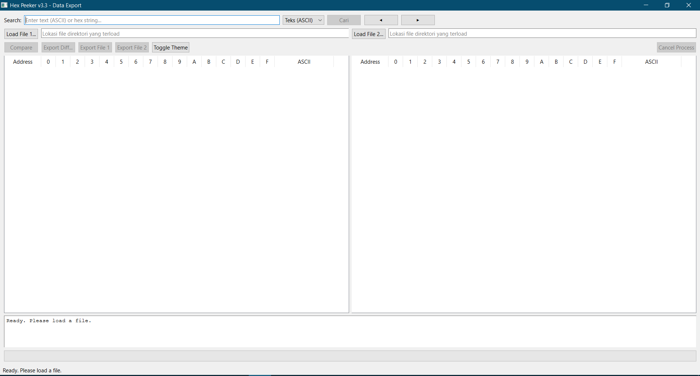
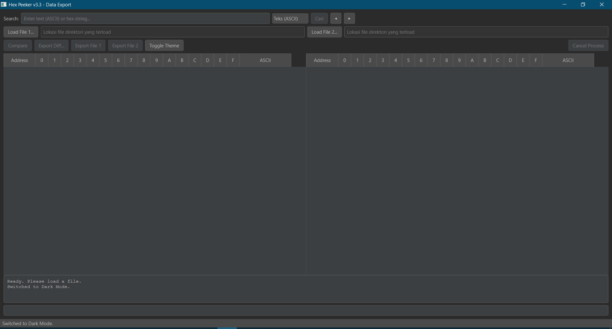
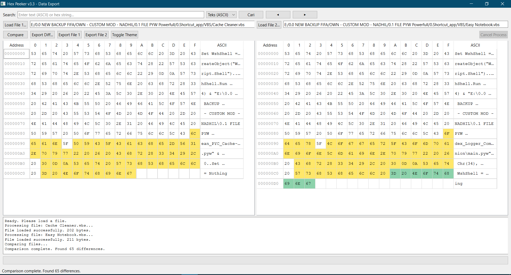

# HeX Peeker 🔍

A sleek Python app to peek into binary and hexadecimal data with a modern, intuitive GUI. Built for developers, reverse engineers, and curious minds.


## Why HeX Peeker? ✨

HeX Peeker is your go-to tool for inspecting binary and hex data with ease. Whether you're debugging binaries, reverse engineering, or just exploring, this app delivers a clean, fast, and modular experience.

- 🔍 **Visual Hex Analysis**: Dive into binary files with a powerful, interactive hex viewer.
- 🎨 **Modern GUI**: Smooth, responsive interface with light/dark themes using tkinter/ttkbootstrap.
- 🧩 **Clean Codebase**: Modular architecture for easy maintenance and extension.
- ⚡ **Performance**: Optimized to handle large binary files without breaking a sweat.
- 🧪 **Tested**: Comprehensive unit tests with pytest for reliability.
- 📦 **Ready to Run**: Simple setup with requirements.txt.

## Sneak Peek 🖼️

- Light Mode
- Dark Mode
- Analysis in Action

## 🚀 Get Started

### Prerequisites

- Python 3.8 or higher
- pip (Python package manager)

### Installation

1. **Clone the repo**:
   ```bash
   git clone https://github.com/nadhilm12/HeX_Peeker.git
   cd HeX_Peeker
   ```

2. **Set up a virtual environment (recommended)**:
   ```bash
   # Create venv
   python -m venv venv
   
   # Activate (Windows)
   venv\Scripts\activate
   
   # Activate (macOS/Linux)
   source venv/bin/activate
   ```

3. **Install dependencies**:
   ```bash
   pip install -r requirements.txt
   ```

## 🛠️ Run It

Launch the app:
```bash
python main.pyw
```
or just double click main.pyw

##  🔥 How to Use

- **Load a File**: Go to File → Open and pick any binary file (.bin, .exe, etc.).
- **Search Patterns**: Hit Ctrl+F to find hex or text patterns in the data.
- **Explore**: Right-click in the hex viewer for extra options like copying hex values.
- **Switch Themes**: Toggle between light and dark mode for comfy viewing.

**Pro Tip**: Check `utils/logs/` if you hit any snags—logs got your back!

## 🧪 Testing

Run the test suite to ensure everything's rock-solid:
```bash
pytest tests/ -v
```

Want a coverage report? Try:
```bash
pytest tests/ --cov=.
```

## 📂 Project Structure

```
HeX_Peeker/
├── assets/         # Screenshots and images
├── core/           # Core logic for hex parsing
├── helpers/        # Utility functions
├── ui/             # GUI components
├── utils/          # Config and logging
├── tests/          # Unit tests
├── main.pyw        # App entry point
├── requirements.txt # Dependencies
└── README.md       # You're here!
```
---

## 🖼️ Screenshots

Main interface (light mode):  


Main interface (dark mode):  


Hex analysis in action:  


---

## 🤝 Contribute

Got ideas to make HeX Peeker even better? We'd love your help!

1. Fork the repo.
2. Create a feature branch: `git checkout -b feat/awesome-idea`.
3. Commit your changes: `git commit -m "feat: add awesome idea"`.
4. Push to your branch: `git push origin feat/awesome-idea`.
5. Open a Pull Request.

Check out our CONTRIBUTING.md for more details (coming soon!).

## ⭐ Show Some Love

If HeX Peeker helps you out, drop a ⭐ on GitHub! It keeps the project alive and motivates us to keep building.

## 📜 License

HeX Peeker is licensed under the MIT License. Feel free to use, modify, and share!


---

Built with 💻 and ☕
